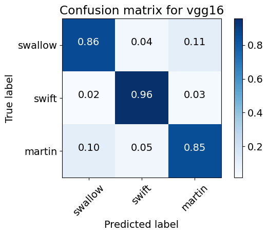
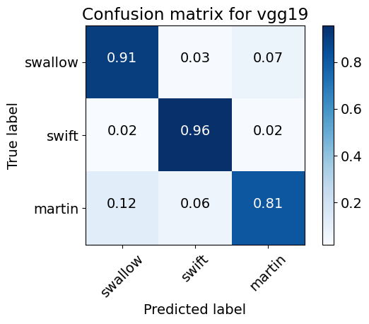
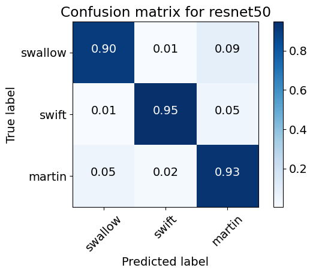

# 🐦 BirdPics: Computer Vision for migratory bird species recognition


This personal project aims to help the **automatization** of migratory bird species identification through image recognition using **Deep Learning**.


## 📋 Table of Contents
1. [Motivation](#-motivation)
2. [Project Overview](#-project-overview)
3. [Workflow](#%EF%B8%8F-workflow)
4. [Repository Structure](#-repository-structure)
5. [Results](#-results)
6. [Authors](#-authors)
7. [License & Credits](#-license--credits)


## 💡 Motivation

Due to human activities and climate change, some migratory bird populations are suffering a significant decline, such as the [common swift](https://www.birdguides.com/articles/conservation/study-examines-factors-driving-long-term-common-swift-decline/). In this context, fast and reliable species censuses are key for conservation, but traditional methods are slow and expensive. However, with the popularity of websites such as [iNaturalist](https://www.inaturalist.org/) and [eBird](https://ebird.org/home), the number of accessible observations made by amateur *birders* has grown exponentially. Using Big Data and Machine Learning, we can train models to reliably identify the species in these observations, reducing the cost of species censuses and helping scientists with their conservation efforts.

## 🧭 Project Overview

This project aims to classify three morphologically similar bird genera commonly found across Europe. In this first version, the considered species are:
**Common Swallows** (*Hirunda rustica*), **Common Swifts** (*Apus apus*), and **Common House Martins** (*Delichon urbicum*).
Accurately identifying these species in real photographs is challenging due to their overlapping morphology and flight patterns.  
This project explores how deep learning models, fine-tuned via transfer learning, can effectively distinguish between them using carefully cleaned and standardized image data.

### Key Features
- ✅ Custom **Agreement Score** metric to select high-quality observations.  
- 🧹 Automated data cleaning using **CLIP (OpenAI)**.  
- ⚙️ Efficient data loading and storage with **HDF5** 
- 🧠 Transfer learning using large image-recognition models: **VGG16**, **VGG19** and **ResNet50**.  
- 📈 Achieved **92% accuracy** on previously unseen images.

## ⚙️ Workflow

### 1️⃣ Data Collection
All observations across Europe of swallows (*Hirunda rustica*), swifts (*Apus apus*), and martins (*Delichon urbicum*) were retrieved from [iNaturalist](https://www.inaturalist.org). From each observation, we retrieved the species guess, image URL, number of observation agreements, and number of observation disagreements (made by iNaturalist users). The last two features were useful for the data cleaning process.

### 2️⃣ Data Cleaning
This was the most elaborate step:
- Removed observations containing audio files, so the identification power relies only on the images.
- Computed a new quality metric, the **Agreement Score**:

  **`agreement_score = observation_agreements - observation_disagreements`**

  This metric measures the overall degree of confidence in the species' guess.
- Selected the top **12,000 observations per species** with the highest Agreement Score.
- Used **CLIP (OpenAI)** to automatically remove irrelevant or low-quality images (feathers, spectrograms, pictures with no visible birds, etc.), reducing dataset size by over **10%**.
- Final dataset: **24,000 high-quality images** (picking the 8000 top images per species using the Agreement Score).

### 3️⃣ Standardization
- Cropped all images to **square format**.  
- Resized to **224×224 pixels** using **bilinear interpolation**.  
- Randomly split into **training**, **validation**, and **test** sets.  
- Saved all processed data as an **HDF5** file for efficient storage and fast reading during model training and evaluation.

### 4️⃣ Model Training
- Applied **transfer learning** with **VGG16**, **VGG19** and **ResNet50** pre-trained on ImageNet.  
- Used **data augmentation** to prevent overfitting (rotation, flip, color jitter, etc).  
- Stored fine-tuned model weights and training metrics.
- The **ResNet50** model achieved the best performance with  
  **Test Accuracy: 92%**

## 📁 Repository Structure

```bash
BirdPics/
│
├── N1_download_dataset.ipynb     # Notebook to download and understand the dataset
├── N2_image_preprocessing.ipynb  # Notebook to understand the data augmentation protocol
├── N3_model_evaluation.ipynb     # Notebook to evaluate the trained models (can be run in Google Colab)
├── colab_notebooks/              # Notebooks aimed to be run on Google Colab for GPU (training)
├── utils/                        # Util functions and classes used in the notebooks
├── models/                       # Saved weights of trained models and training metrics
├── other_files/                  # Other files used in the notebooks
├── requirements.txt              # Python dependencies
└── README.md
```

⚠️ Due to dataset size (>3GB), the full image dataset is hosted on [Kaggle](https://www.kaggle.com/datasets/jgbeniqu/birdpics-spanish-migratory-bird-image-dataset?select=README.txt).
Please run `N1_download_dataset.ipynb` to download it (or download it manually) before running the other scripts. To download the dataset to Google Drive, run the `colab_notebooks/download_gdrive.ipynb` in Google Colab.

## 📊 Results

Summary of the accuracy results:

| Model    | Validation Accuracy | Test Accuracy |
| -------- | ------------------- | ------------- |
| VGG16    | 88%                 | 88%           |
| VGG19    | 90%                 | 89%           |
| ResNet50 | **91%**             | **92%**       |

**ResNet50** achieves a better performance overall.

Analyzing in more detail, **ResNet50** is also the **most well-rounded model** (with no accuracy per class going below 90%)

  

### 🔎 Insights
- Swifts were the species with the highest accuracy among models.
- Connected to the previous, all models confused swallows and martins between themselves the most, which led to worse results in their class accuracy. This is expected, as they are quite similar morphologically.
- Some missclassifications were due to low-quality images due to imperfect cleaning. This could be corrected by refining the cleaning process, as CLIP did not yield perfect results.

### 🚀 Future work
- Refine the automated cleaning process. One option would be using an instructed **AI agent-based** pipeline as an image cleaner.
- **Enhance the dataset** to include more migratory species and improve the taxonomic coverage
- Explore more lightweight architectures similar to ResNet50 for **real-time inference**.

## 👷 Authors

- [@jgbeni](https://www.github.com/jgbeni)

## 📜 License & Credits

Code License

This repository is released under the [MIT](https://choosealicense.com/licenses/mit/) License.

### Dataset Attribution

All image data come from [iNaturalist](https://www.inaturalist.org/), licensed under [CC BY-NC 4.0](https://creativecommons.org/licenses/by-nc/4.0/deed.en).

If you use this dataset or code, please credit:

```
“Jorge García-Beni — BirdPics: Computer Vision for migratory bird species recognition (2025)”
```

